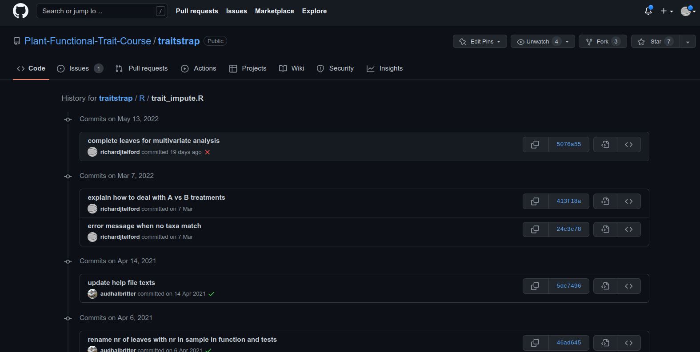

# Recording the history of your projects

## What is Version Control?

Version control is a system that records changes to a file or set of files over time so that you can recall specific versions later.

## Question?

 

How do you record the history of your projects?

 

## Bad

From Piled Higher and Deeper by Jorge Cham, http://www.phdcomics.com.

## Good

~~~
    2013-10-14_manuscriptFish.doc
    2013-10-30_manuscriptFish.doc
    2013-11-05_manusctiptFish_intitialRyanEdits.doc
    2013-11-10_manuscriptFish.doc
    2013-11-11_manuscriptFish.doc
    2013-11-15_manuscriptFish.doc
    2013-11-30_manuscriptFish.doc
    2013-12-01_manuscriptFish.doc
    2013-12-02_manuscriptFish_PNASsubmitted.doc
    2014-01-03_manuscriptFish_PLOSsubmitted.doc
    2014-02-15_manuscriptFish_PLOSrevision.doc
    2014-03-14_manuscriptFish_PLOSpublished.doc
~~~

## Better - Saving everything together at once

Every time you make a save, you zip the entire directory that your project files are in and save it with a date.

## Best - Version Control

 

What you changed and why you changed it.

## How does a version control system work?

## 

- Version control systems start with a base version of the document and then save just
the changes you made at each step of the way.

- You can think of it as a tape: if you rewind the tape and start at the base document, then you can play back each change and end up with your latest version.

  

From [Software Carpentry](https://software-carpentry.org/).

## 

- You can then think about "playing back" different sets of changes onto the base document and getting different versions of the document.

  

From [Software Carpentry](https://software-carpentry.org/).

# Why use Git and GitHub

## Why use Git?

- Makes you fearless
- Easy to set up
- Allows you to take a snapshot of every stage of your project history
- Takes up minimal space
- Creates a easy navigable map to the history of all changes made
- Distributed - can work offline

## Features of using a Hosting Service Like Github

- Backup of your project
- No need for a server: easy to set up
- GitHub's strong community: your colleagues are probably already there
- Provides tools to help enhance collaboration

    _"Your closest collaborator is YOU six months ago but you don’t reply to email."_
    
- A common location to share/show off your work
- Free public repositories
- Free private repositories
- GitHub Actions - automatically run code
- GitHub Pages - free website hosting

## Example

   

From Code for RNeXML R package, plus RNeXML publication in RMarkdown, [https://github.com/ropensci/RNeXML](https://github.com/ropensci/RNeXML).

## Workflow

- Create a git repo for your RStudio project
- Create a GitHub repo for your project
- Edit files in Rstudio
- Commit and push files from the RStudio git pane

## More info on the Git pane

File tracking:

- The RStudio Git pane lists every file that’s been added, modified or deleted. 

- The icon describes the change:
    +  **Modified:** You've changed the contents of the file.
    +  **Untracked:** You've added a new file that Git hasn't seen before.
    +  **Deleted:** You've deleted a file.

You can get more details about modifications with a :

- Green: added text

- Red: removed text

## What's in my Git pane?

- When you create your repo in an RStudio project you a bonus file: `.gitignore`

- They're both showing up as **untracked** since Git hasn't seen them before. You can stage, commit, and push those files to your repository.

- `.gitignore`: Git uses this file to determine which files and directories to ignore, before you make a commit.

## Branches

Feature **branches** let you develop new ideas without risking your main code. Especially important in collaborative work.

If you like the new branch you can **merge** it with the original branch

### Conflicts

If the same part of the file has conflicting edits, there is a merge conflict which needs to be fixed. 

## Collaborating

- **Forking** is creating a copy of a git repository into your own account.  
-  Forking allows you to make changes to a repository without affecting the main repository of the project.  
-  This is one of the most exciting aspects of Github - you essentially encouraged to copy and play with anyone's code! 
- If you have made useful changes, use a **pull request** to suggest the maintainer of the original repo includes your edits.

## Reading

- http://www.r-bloggers.com/rstudio-and-github/

- http://stackoverflow.com/questions/2712421/r-and-version-control-for-the-solo-data-analyst

- [Rstudio, Git and GitHub](http://r-pkgs.had.co.nz/git.html)

- [Happy git with R](https://happygitwithr.com/)

- [Git flight rules](https://github.com/k88hudson/git-flight-rules)
(what to do when things go wrong.)
