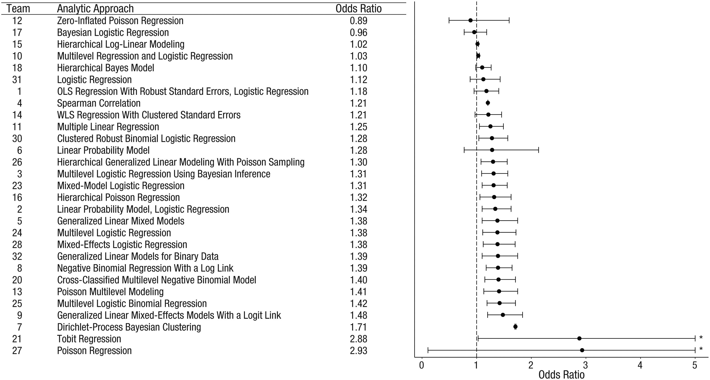

## Who I am

 - Palaeoecologist/ecologist with numerical interests
 - R user since 2002
 
 - Interested in
    - Reconstructing environmental change
    - Effect of climate change on ecosystems
    - Reproducibility in science

email: richard.telford@uib.no

Class git: https://github.com/richardjtelford/Bio302

## Schedule

Wednesdays 0815 - 1130, 1230 - 1500
Fridays 0915 - 1130, 1230 - 1400

 - Wednesday 19^th^ 
 - Friday 21^st^ 
 - Wednesday 26^st^ 
 - Friday 28^nd^ 
 - Wednesday 2^nd^ 
 - Friday 4^th^ 

## Exam

 - Take home exam
 - Deadline two weeks after exam set

## Two Questions

 1. What statistics do you think you need?
 2. What do you find hard about data analysis?

## Course Contents

From data to paper:  

 1. Reproducible data analysis
 2. Statistics  

## Assumptions of Least Squares Regression

 1. The relationship between the response and the predictors is ~linear.
 2. The residuals have a mean of zero.
 3. The residuals have constant variance (not heteroscedastic).
 4. The residuals are independent (uncorrelated).
 5. The residuals are normally distributed.

How to identify when these assumptions are violated.

What to do when these assumptions are violated.

## Statistics

 - Exploratory data analysis
 - Linear regression
 - Analysis of variance with contrast matrices
 - Generalised least-squares
 - Non-linear least-squares
 - Generalised linear models
 - Generalised additive models
 - Mixed effect models
 - Introduction to Bayesian analysis

## Reproducible data analysis

 - Is your current data analysis reproducible?
 - Why is reproducible data analysis important?
  
## Tools for reproducible data analysis

 - Use an integrated development environment (e.g. RStudio)
 - Adopt an R style guide
 - Getting help
 - Version control with git
 - Rmarkdown for dynamic documents
 - Data handling with `tidyverse`
 

## Reproducibility Crisis

```{r echo = FALSE, cache = TRUE}
knitr::include_graphics("F1.large.jpg")
``` 

Open Science Collaboration 2015 Estimating the reproducibility of psychological science [Science 349: aac4716](https://science.sciencemag.org/content/349/6251/aac4716)

## Most scientists 'can't replicate studies by their peers'

### Read

[Most scientists 'can't replicate studies by their peers'](http://www.bbc.com/news/science-environment-39054778)

[Bishop 2019. Rein in the four horsemen of irreproducibility](https://www.nature.com/articles/d41586-019-01307-2)

### Questions


 - What is reproducibility?
 - Why are papers non-reproducible
 - Does this affect Biology?
 - What is the role of statistics in reproducible analyses
 
 
[What does research reproducibility mean?](http://stm.sciencemag.org/content/8/341/341ps12.full) 

##

Bad luck

 - False Discovery
 
Questionable research practices

 - HARKING
 - p-Hacking
 - Publication bias
 
Misconduct

 - Fabrication, Falsification 


## P-values

Often misinterpreted
 
 - Not a measure of effect size or practical significance
 - Not the probability that hypothesis is true
 - Strongly affected by sample size

_If there were actually no effect (if the true difference between means were zero) then the probability of observing a value for the difference equal to, or greater than, that actually observed would be p=0.05._

Many assumptions

## [Multiple testing](https://imgs.xkcd.com/comics/significant.png)

```{r echo = FALSE, out.width = "200px", cache = TRUE}
knitr::include_graphics("https://imgs.xkcd.com/comics/significant.png")

``` 

 
## False discovery rate
```{r echo = FALSE, out.width = "350px", cache = TRUE}
knitr::include_graphics("https://imgs.xkcd.com/comics/frequentists_vs_bayesians.png")
``` 


##
[Colquhoun 2014. An investigation of the false discovery rate and the misinterpretation of p-values](http://rsos.royalsocietypublishing.org/content/1/3/140216)

_If you use p=0.05 to suggest that you have made a discovery, you will be wrong at least 30% of the time. If, as is often the case, experiments are underpowered, you will be wrong most of the time_

```{r echo = FALSE, out.width = "500px", cache = TRUE}
knitr::include_graphics("https://royalsocietypublishing.org/cms/attachment/07568509-44a9-46a5-beab-65000fa05dae/rsos140216f01.jpg")

``` 

## Choice of statistical methods

```{r echo = FALSE, out.width = "700px", cache = TRUE}

``` 

Silberzahn et al. (2018) Many Analysts, One Data Set: Making Transparent How Variations in Analytic Choices Affect Results. _Advances in Methods and Practices in Psychological Science_ [September 2018:337-356.](https://doi.org/10.1177/2515245917747646)

## Questionable research practices


```{r echo = FALSE, out.width = "500px", cache = TRUE}
knitr::include_graphics("pone.0200303.g001.PNG_L.png")
``` 

Fraser H et al (2018) Questionable research practices in ecology and evolution. PLoS ONE 13(7): [e0200303.](https://doi.org/10.1371/journal.pone.0200303)

## P-hacking

[Try P-hacking economic data](https://projects.fivethirtyeight.com/p-hacking/)

Predictors - US politicians

Response - Economic performance indicators

Other options

Find a significant positive and negative relationships between one party and the economy

## Garden of forking paths

Researcher degrees of freedom

Many decisions to be made

Can be difficult to predict in advance

[Gelman and Loken 2013](http://www.stat.columbia.edu/~gelman/research/unpublished/p_hacking.pdf)

## Publication bias

Can be more difficult to publish "negative" results

Explore publication bias with shiny app.

In RStudio

 - install `devtools` package
 - install `biostats.apps` package with `devtools::install_github("biostats-r/biostats.apps")`
 - load `biostats.apps` package with `library()`
 - run `publication_bias_app()`
 
The app simulates the effect of publication bias on the literature is only "significant" studies are published


## Misconduct?

Schiermeier (2017) Investigation finds Swedish scientists committed scientific misconduct. [Nature](https://www.nature.com/articles/d41586-017-08321-2)

Enserink (2021) Does ocean acidification alter fish behavior? Fraud allegations create a sea of doubt. [Science]( https://www.sciencemag.org/news/2021/05/does-ocean-acidification-alter-fish-behavior-fraud-allegations-create-sea-doubt)

Viglione (2020) ‘Avalanche’ of spider-paper retractions shakes behavioural-ecology community [Nature](https://www.nature.com/articles/d41586-020-00287-y)


## Solutions

- Pre-registration
- Reproducible workflows
- Data management plans

## Reproducible workflows

<iframe width="560" height="315" src="https://www.youtube.com/embed/58FUfrIM6bE" title="YouTube video player" frameborder="0" allow="accelerometer; autoplay; clipboard-write; encrypted-media; gyroscope; picture-in-picture" allowfullscreen></iframe>

https://laskowskilab.faculty.ucdavis.edu/2020/08/03/keeping-a-paper-trail-data-management-skills-for-reproducible-science/


## Data management plans

[Open Access to Research Data](https://www.uib.no/en/ub/111372/open-access-research-data)
 
Avoid the [stolen laptop scenario](https://retractionwatch.com/2021/05/03/ecologist-who-lost-thesis-awards-earns-expressions-of-concern-after-laptop-stolen/) 
 
## General Reading

 - Gillespie, C and Lovelace, R (2016) Efficient R programming. https://csgillespie.github.io/efficientR/
 - Crawley, MJ (2012) The R Book. Wiley.
 - Wickham, H. and Garrett Grolemund, G. (2017) R for Data Science [https://r4ds.had.co.nz/](https://r4ds.had.co.nz/)
 - Zuur AF et al (2009) Mixed effects models and extensions in ecology with R. Springer. 	